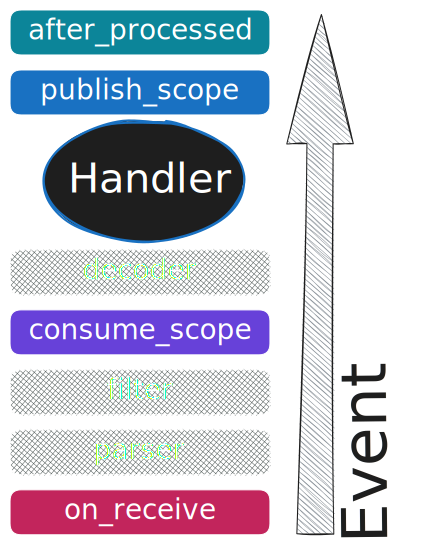

---
# 0.5 - API
# 2 - Release
# 3 - Contributing
# 5 - Template Page
# 10 - Default
search:
  boost: 10
---

# Middlewares

**Middlewares** are a powerful tool that allow you to add additional logic to any part of the message processing pipeline.

This way, you can significantly improve your **FastStream** experience with features such as:

- Integration with various logging and monitoring systems
- Application-level message serialization logic
- Extensive publishing of messages with additional information
- And many other features

**Middlewares** have several methods that you can override. You can choose whether to implement some or all of these methods.

You only need to import the BaseMiddleware as it contains all the necessary methods. Any available methods can be overridden.

```python linenums="1" hl_lines="10 16 25 34"
from types import TracebackType
from typing import Any, Awaitable, Callable, Optional
from faststream import BaseMiddleware
from faststream.message import StreamMessage
from faststream.response import PublishCommand

class MyMiddleware(BaseMiddleware):
    # Use this if you want to add logic when a message is received for the first time,
    # such as logging incoming messages, validating headers, or setting up the context.
    async def on_receive(self) -> Any:
        print(f"Received: {self.msg}")
        return await super().on_receive()

    # Use this if you want to wrap the entire message processing process,
    # such as implementing retry logic, circuit breakers, rate limiting, or authentication.
    async def consume_scope(
        self,
        call_next: Callable[[StreamMessage[Any]], Awaitable[Any]],
        msg: StreamMessage[Any],
    ) -> Any:
        return await call_next(msg)

    # Use this if you want to customize outgoing messages before they are sent,
    # such as adding encryption, compression, or custom headers.
    async def publish_scope(
        self,
        call_next: Callable[[PublishCommand], Awaitable[Any]],
        cmd: PublishCommand,
    ) -> Any:
        return await super().publish_scope(call_next, cmd)

    # Use this if you want to perform post-processing tasks after message handling has completed,
    # such as cleaning up, logging errors, collecting metrics, or committing transactions.
    async def after_processed(
        self,
        exc_type: type[BaseException] | None = None,
        exc_val: BaseException | None = None,
        exc_tb: Optional[TracebackType] = None,
    ) -> bool | None:
        return await super().after_processed(exc_type, exc_val, exc_tb)
```

PayAttention to the order: the methods are executed in this sequence after each stage. Read more below in [Middlewares Flow](#middlewares-flow).

**Middlewares** can be used Broker scope or [Router](../routers/index.md){.internal-link} scope. For example:

```python
broker = Broker(middlewares=[MyMiddleware])  # global scope
# Or
router = BrokerRouter(middlewares=[MyMiddleware])  # router scope
```

## Middlewares Flow

The middleware execution follows a specific sequence during message processing:

{ width=300 height=100 }

1. **on_receive** - This function is called first for every incoming message, regardless of whether the message will be processed.
2. [**parser**](../serialization/parser.md){.internal-link} - Converts native broker messages (aiopika, aiokafka, redis, etc.) into FastStream's StreamMessage format
3. [**filter**](../subscription/filtering.md){.internal-link} - Applies filtering logic based on user-defined filter parameters.
4. [**consume_scope**](../subscription/index.md){.internal-link} - If the filter passes, the flow continues. Otherwise, it stops here.
5. [**decoder**](../serialization/decoder.md){.internal-link} - Deserializes message bytes into dictionaries or structured data.
6. **Handler** - Executes the message handling function
7. [**publish_scope**](../publishing/decorator.md){.internal-link} - For each `@publisher` decorator, the function is called (if there are 4 publishers, the function will be called 4 times).
8. **after_processed** - Final cleanup and post-processing stage.

## More about the **publish_scope**

1. If you want to intercept the publishing process, you will need to use the **publish_scope** method.
2. This method consumes the message body and any other options passed to the `publish` function (such as destination headers, etc.).
3. **publish_scope** affect all ways of publishing something, including the `#!python broker.publish` call.
4. If the basic PublishCommand does not meet your needs, you can use the extended option. Here is an example:

=== "Default"
    ```python linenums="1"
    from typing import Any, Awaitable, Callable
    from typing_extensions import override
    from faststream import BaseMiddleware
    from faststream.response import PublishCommand

    class DefaultPublishMiddleware(BaseMiddleware):
        @override
        async def publish_scope(
            self,
            call_next: Callable[[PublishCommand], Awaitable[Any]],
            cmd: PublishCommand,
        ) -> Any:
            return await super().publish_scope(call_next, cmd)
    ```

=== "Kafka"
    ```python linenums="1"
    from typing import Any, Awaitable, Callable
    from typing_extensions import override
    from faststream import BaseMiddleware
    from faststream.kafka.response import KafkaPublishCommand

    class KafkaPublishMiddleware(BaseMiddleware[KafkaPublishCommand]):
        @override
        async def publish_scope(
            self,
            call_next: Callable[[KafkaPublishCommand], Awaitable[Any]],
            cmd: KafkaPublishCommand,
        ) -> Any:
            return await super().publish_scope(call_next, cmd)
    ```

=== "RabbitMQ"
    ```python linenums="1"
    from typing import Any, Awaitable, Callable
    from typing_extensions import override
    from faststream import BaseMiddleware
    from faststream.rabbit.response import RabbitPublishCommand

    class RabbitPublishMiddleware(BaseMiddleware[RabbitPublishCommand]):
        @override
        async def publish_scope(
            self,
            call_next: Callable[[RabbitPublishCommand], Awaitable[Any]],
            cmd: RabbitPublishCommand,
        ) -> Any:
            return await super().publish_scope(call_next, cmd)
    ```

=== "NATS"
    ```python linenums="1"
    from typing import Any, Awaitable, Callable
    from typing_extensions import override
    from faststream import BaseMiddleware
    from faststream.nats.response import NatsPublishCommand

    class NatsPublishMiddleware(BaseMiddleware[NatsPublishCommand]):
        @override
        async def publish_scope(
            self,
            call_next: Callable[[NatsPublishCommand], Awaitable[Any]],
            cmd: NatsPublishCommand,
        ) -> Any:
            return await super().publish_scope(call_next, cmd)
    ```

=== "Redis"
    ```python linenums="1"
    from typing import Any, Awaitable, Callable
    from typing_extensions import override
    from faststream import BaseMiddleware
    from faststream.redis.response import RedisPublishCommand

    class RedisPublishMiddleware(BaseMiddleware[RedisPublishCommand]):
        @override
        async def publish_scope(
            self,
            call_next: Callable[[RedisPublishCommand], Awaitable[Any]],
            cmd: RedisPublishCommand,
        ) -> Any:
            return await super().publish_scope(call_next, cmd)
    ```

## Context Access

Middlewares can access the [Context](../context/){.internal-link} for all available methods. For example:

```python linenums="1" hl_lines="11"
from faststream import BaseMiddleware

class ContextMiddleware(BaseMiddleware):
    # Context is also available in the on_receive, consume_scope, publish_scope, and after_processed methods.
    async def consume_scope(
        self,
        call_next: Callable[[StreamMessage[Any]], Awaitable[Any]],
        msg: StreamMessage[Any],
    ) -> Any:
        # Access context
        message_context = self.context.get_local("message")
        # Your middleware logic here
        return await call_next(msg)
```

## Examples

### Retry Middleware

```python
import asyncio
from typing import Any, Awaitable, Callable, Final
from typing_extensions import override
from faststream import BaseMiddleware
from faststream.message import StreamMessage

class RetryMiddleware(BaseMiddleware):
    MAX_RETRIES: Final[int] = 3

    @override
    async def consume_scope(
        self,
        call_next: Callable[[StreamMessage[Any]], Awaitable[Any]],
        msg: StreamMessage[Any],
    ) -> Any:
        for attempt in range(self.MAX_RETRIES + 1):
            try:
                return await call_next(msg)
            except Exception as e:
                if attempt == self.MAX_RETRIES:
                    print(f"Failed after {self.MAX_RETRIES} retries: {e}")
                    raise

                print(f"Attempt {attempt + 1} failed, retrying: {e}")
                await asyncio.sleep(2**attempt)  # Exponential backoff
        return None
```

1. **consume_scope** makes calls before the [**decoding stage**](#middlewares-flow), which means there is no deserialized message.

## Summary

Middlewares provide a powerful way to extend FastStream's message processing pipeline at specific stages. Key points to remember:

1. [**Order of execution matters**](#middlewares-flow) - Methods are called in a specific sequence: `on_receive` → parser → filter → `consume_scope` → decoder → handler → `publish_scope` → `after_processed`.
2. [**Conditional Execution**](../subscription/filtering.md){.internal-link} - If a message fails to pass the filter, `consume_scope` and subsequent stages will be skipped.
3. **Multiple publish calls** - The `publish_scope` function is executed once for each `@publisher` decorator in your handler.
4. **Always call super()** - This ensures proper error handling and maintains the middleware chain.
5. [**Context Access**](../context/index.md){.internal-link} - All middleware methods have access to the FastStream context for shared state management.
6. [**Broker-specific extensions**](#more-about-the-publishscope) - Use typed publish commands (KafkaPublishCommand, RabbitPublishCommand, etc.) to provide specific functionality for different brokers.

Choose the right middleware method based on your specific needs: `on_receive` to handle all incoming messages, `consume_scope` to process data, `publish_scope` to send outgoing messages, and `after_processed` to perform cleanup tasks.
